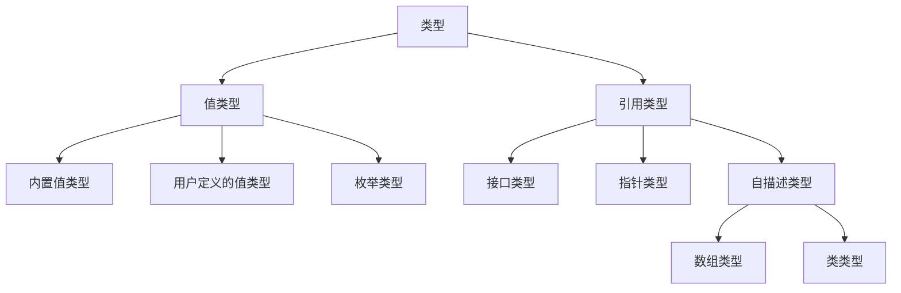

## 你必须知道的.NET-读书笔记
* 对象分为`值类型`和`引用类型`两种，其依据是对象在运行时在内存中的位置，值类型位于线程的`堆栈`，而引用类型位于`托管堆`。

* 值类型与引用类型的转变分别叫`装箱`和`拆箱`。

* 访问修饰符
  
  | 访问修饰符 | 访问权限  
  | :- | :-  
  | public | 对访问成员没有限制，属于最高级别访问权限  
  | protected | 访问包含类或者从包含类派生的类  
  | internal | 访问仅限于程序集  
  | protected internal | 访问仅限于从包含类派生的当前程序集或类型。也就是同一个程序集的对象，或者该类及其子类可以访问  
  | private | 访问仅限于包含类型  

* 对象中的多态主要有以下两种情况  
  1. 接口实现多态  
  2. 抽象类实现多态  

* 继承，就是面向对象中类与类之间的关系。继承的类称为子类、派生类，而被继承类称为父类、基类或超类。通过继承，使得子类具有父类的属性和方法，同时子类也可以通过加入新的属性和方法或修改父类的属性和方法建立新的类层次。CLR支持实现单继承和接口多继承。  

* 继承的本质  
  1. 继承是可传递的，子类是对父类的扩展，必须继承父类方法，同时可以添加新方法  
  2. 子类可以调用父类方法和字段，而父类不能调用子类方法和字段  
  3. 虚方法如何实现覆写操作，使得父类指针可以指向子类对象成员
  4. 子类不光继承父类的公有成员，同时继承了父类的私有成员，只是在子类中不被访问  
  5. new 关键字在虚方法继承中的阻断作用  
   
* 抽象类与接口的对比  
  1. 抽象类适合于有族层概念的类间关系，而接口最适合为不同的类提供通用功能  
  2. 接口着重于CAN-DO关系类型，而抽象类则偏重于IS-A式的关系  
  3. 接口多定义对象的行为；抽象类多定义对象的属性  
  4. 如果预计会出现版本问题，可以创建“抽象类”  
  5. 因为值类型是密封的，所以只能实现接口，而不能继承类  

* 继承的毒瘤主要体现在  
  1. 继承可能造成子类的无限膨胀，不利于类体系的维护和安全  
  2. 继承的子类对象确定于编译期，无法满足需要运行期才确定的情况，而类聚合很好地解决了这一问题  
  3. 随着继承层次的复杂化和子类的多样化，不可避免地会出现对父类的无效继承或者有害继承

* 继承的规则  
  1. 密封类不可以被继承  
  2. 继承关系中，我们更多的是关注其共性而不是特性，因为共性是层次复用的基础，而特性是系统扩展的基点  
  3. 实现单继承，接口多继承  
  4. 从宏观来看，继承多关注于共性；而多态多着眼于差异性  
  5. 继承的层次应该有所控制，否则类型之间的关系继护会消耗更多的精力  
  6. 面向对象原则：多组合，少继承；低耦合，高内聚  

* 封装隐藏了类内部的具体实现细节，对外则提供统一访问接口，来操作内部数据成员  
* 字段通常定义为private,表示类的状态信息  
* 属性通常定义为public,表示类的对外成员  
* 方法封装了类的行为，提供了类的对外表现  

* 封装的意义  
  1. 隐藏系统实现的细节，保证系统的安全性和可靠性  
  2. 提供稳定不变的对外接口  
  3. 封装保证了代码模块化，提高了软件的利用和功能分离  
   
* 封装的规则  
  1. 尽可能地调用类的访问器，而不是成员，即使在类的内部  
  2. 内部私有部分可以任意更改，但是一定要在保证外部接口稳定的前提下  
  3. 将对字段的读写控制实现为属性，而不是方法，否则舍近求远，非明智之选  
  4. 类封装是由访问权限来保证的，对内实现为private,对外实现为public,再结合继承特性，还要对protected,internal有较深的理解  
  5. 封装的精华是封装变化  
   
* 封装就是一个包装，将包装的内外分为两个空间，对内实现数据私有，对外实现方法调用，保证了数据的完整性和安全性  

* 多态指同一操作作用于不同的实例，产生不同运行结果的机制  
* 多态按实现方式分为`基类继承式多态`和`接口实现式多态`  

* 多态的规则和意义  
  1. 多态提供了对同一类对象的差异化处理方式，实现了对变化和共性的有效封装和继承，体现了“一个接口，多种方法”的思想，使方法抽象机制成为可能  
  2. 在.NET中，默认情况下方法是非虚的，以C#为例必须显式地通过virtual或者abstract标记虚方法或抽象方法，以便在子类中覆写父类方法  
  3. 在面向对象的基本要素中，多态和继承、多态和重载存在紧密的联系，正如前文所述多态的基础就是建立有效的继承体系，因此继承和重载是多态的实现基础  

* 所谓接口，就是契约，用于规定一种规则由大家遵守
* 接口规则  
  1. 接口隔离原则强调接口应该被实现为具有单一功能的小接口，而不要实现为具有多个功能的胖接口，类对于类的依赖应建立在最小的接口之上  
  2. 接口支持多继承，既可以作用于值类型，也可以作用于引用类型  
  3. 禁止为已经发布的接口，添加新的成员，这意味着你必须重新修改所有实现了该接口的类型  
  4. 接口不能被实例化，没有构造函数，接口成员被隐式声明为public  

---  

* 设计原则  
  
  | 设计原则 | 英文表达 | 说明  
  | :- | :- | :-  
  | 单一职责原则 | SRP，Single Responsiblity Principle | 一个类，应该仅有一个引起它变化的原因，不要将变化原因不同的职责封装在一起，而应该分离  
  | 开放封闭原则 | OCP，Open Closed Principle | 软件实体应当对修改关闭，对扩展开放  
  | 依赖倒置原则 | DIP，Dependency Inversion Priciple | 依赖于抽象，而不要依赖于具体，因为抽象相对稳定  
  | 接口隔离原则 | ISP，Interface Inversion Priciple | 尽量应用专门的接口，而不是单一的总接口，接口应该面向用户，将依赖建立在最小的接口上  
  | Liskov替换原则 | LSP，Liskov Substitution Principle | 子类必须能够替换其基类  
  | 合成/聚合利用原则 | CARP，Composite/Aggregate Reuse Principle | 在新对象中聚合已有对象，使之成为新对象的成员，从而通过操作这些对象达到利用的目的，合成方式较继承方式耦合更松散，所以应该少继承、多聚合  
  | 迪米物法则 | LoD，Law of Demeter | 又叫最少知道原则，指软件实体应该尽可能少的和其他软件实体产生相互作用  

* 单一职责建议  
  1. 一个类只有一个引起它变化的原因，否则就应当考虑重构  
  2. SRP由引起变化的原因决定，而不由功能职责决定。虽然职责常常是引起变化的轴线，但是有时却未必，应该审时度势  
  3. 测试驱动开发，有助于实现合理分离功能的设计  
  4. 可能通过Facade模式或Proxy模式进行职责分离  
   
* 开放封闭建议  
  1. 开放封闭原则，是最为重要的设计原则，Liskov替换原则和合成/聚合利用原则为开放封闭原则的实现提供保证  
  2. 可以通过Template Method模式和Strategy模式进行重构，实现对修改封闭、对扩展开放的设计思路  
  3. 封装变化，是实现开放封闭原则的重要手段，对于经常发生变化的状态一般将其封装为一个抽象  
  4. 拒绝滥用抽象，只将经常变化的部分进行抽象，这种经验可以从设计模式的学习与应用中获得  

*  依赖倒置建议  
    1. 抽象的稳定性决定了系统的稳定性，因为抽象是保持不变的，依赖于抽象是面向对象设计的精髓，也是依赖倒置原则的核心思想  
    2. 依赖于抽象是一个通用的规则，而某些时候依赖于细节是在所难免的，必须权衡在抽象和具体之间的取舍，方法不是一成不变的  
    3. 依赖于抽象，就是要对接口编程，不要对实现编程  

* 接口隔离建议  
  1. 将功能相近的接口合并，可能造成接口污染，实现内聚的接口才是接口设计的基本原则  
  2. 接口隔离原则，能够保证系统扩展和修改的影响不会扩展到系统的其他部分，一定程序上保证了对开放封闭原则的遵守  

* Liskov替换建议  
  1. Liskov 替换原则是关于继承机制的设计原则，违反了Liskov 替换原则就必然导致违反开放封闭原则  
  2. Liskov 替换原则能够保证系统具有良好的雇工性，同时实现了基于态的抽象机制，能够减少代码冗余，避免运行期的类型判别  
  3. 子类必须满足基类和客户端对其的行为约定，客户端对行为的期望在基类和子类必须保持一致  
  4. IS-A 是基于行为方式的，它依赖于客户端的调用方式，对象的行为方式才是值得关注的要素  
  5. 子类的异常必须控制在父类可能预计的范围，否则将导致替换违规，违反了Liskov 替换原则  

---

* 为什么要依赖倒置  
  1. 依赖倒置是保证开放封闭的前提和基础  
  2. 依赖倒置是对抽象和依赖的基本原则和基本思想的哲学阐释  
  3. 依赖倒置是框架设计的核心思想  
  4. 依赖倒置是控制反转和依赖注入的思想基础  

* 控制反转，简言之就是代码的控制器交由系统控制，而不是在代码内部，通过IoC，消除组件或者模块间的直接依赖，使得软件系统的开发更具柔性和扩展性  
* 依赖注入，客户类依赖于服务类的抽象接口，并在运行时根据上下文环境，由其他组件实例化具体的服务类实例，将其注入到客户类的运行时环境，实现客户类与服务类实例之间松散的耦合关系 
* 依赖注入的方法  
  1. 接口注入，将对象间的关系转移到一个接口，以接口注入实例  
  2. 构造器注入，客户类在类型构造时，将服务类实例以构造函数参数的形式传递给客户端，因此服务类实例一旦注入将不可修改  
  3. 属性注入，通过客户类属性设置的方式，将服务器类实例在运行时设定为客户类属性，相较构造器注入方式，属性注入提供了改写服务类实例的可能  
  4. .NET平台中，一种更优雅的选择是使用 Attribute  

* 依赖注入框架，Unity、ObjectBuilder、Castle、Sprint.NET  

* 典型的设计模式   

  | 类别 | 依赖 | 模式 
  | :- | :- | :- 
  | 创建型模式 | 创建型模式的核心关注点就在于对象创建的依赖关系上，将对象的依赖从new操作中解脱出来，隔离应用系统和类型实例化间的依赖 | 工厂方法、抽象工厂、单例、创建者、原型模式 
  | 结构型模式 | 结构型模式，是将简单类型组合为复杂类型的过程，通过灵活的设计要素，最终保证不同类型间保持尽量间接的引用和尽量松散的耦合，在复杂类型有更多变化与诉求时，以最小的代价兼容变化，扩展诉求 | 桥接、适配器、组合、外观、装饰、享元、代理 
  | 行为型模式 | 行为型模式，关注对象行为的扩展和对象间数据关系的通信，以面向对象方式描述控制流 |模板方法、迭代器、中介者、职责链、解释器、命令、观察者、备忘录、状态、策略、访问者 

* 一点总结  
  1. 以new创建对象，是对依赖倒置原则的典型违反，可能通过工厂模式或者依赖注入来解决  
  2. 一个对象持有另外一个具体对象的引用可能破坏了依赖倒置  
  3. 所有结构良好的面向对象架构都具有清晰的层次定义，每个层次通过一个定义良好的受控接口向外提供一组内聚的服务  
  4. 依赖倒置预示着程序中的依赖关系不应是具体的类型，而应是抽象类和接口  
  5. 依赖倒置适用于当一个类向另一个类发送消息的任何情况  

* 常用模式解析  
  
  | 模式名称 | 模式起点 | 典型应用 
  | :- | :- | :- 
  | 工厂方法(Factory Method Pattern) | 将程序中创建对象的操作单独进行处理，大大提高了系统扩展的柔性，接口的抽象化处理给互相依赖的对象创建提供了最好的抽象模式 | 工厂方法模式是最简单也最容易理解的模式之一。其关注的核心是对于对象创建这件事儿的分离 
  | 单例(Singleton Pattern) | 一个类只有一个实例，且提供了一个访问全局点的方式，更加灵活保证了实例的创建和访问约束，并且唯一约束的实施由类本身实现 | 一个类只有一个实例，经常被应用于Facade模式，称为单例外观 
  | 命令(Command Pattern) | 将请求封装为对象，从而将命令的执行和责任分开。通常在队列中等待命令 | 菜单系统 
  | 策略(Strategy Pattern) | 将易于变化的部分封装为接口，通常Strategy封装一些运算法则，使之能互换 | 数据层常考虑以策略提供算法和数据的分离 
  | 迭代器(Iterator Pattern) | 提供一种方法访问容器对象中各个元素，而又无需暴露该对象的内部细节 | .NET中就是应用了迭代器来创建用于foreach的集合 
  | 模板方法(Template Method Pattern) | 就是在父类中定义模板，然后由子类实现 | ASP.NET的Page类
  | 观察者(Observer Pattern) | 定义对象间的一种一对多的依赖关系，当一个对象的状态发生改变时，所有依赖于它的对象都得到通知并自动更新 | 在.NET中使用委托和事件可以更好地实现观察者模式 
  | 职责链(Chain of Responsibility Pattern) | 将操作组成一个链表，通过遍历操作链表找到合适的处理器。通过统一的接口，被多个处理器实现，每个处理器都有后继处理器，可以将请求沿着处理器链传递 | GUI系统的事件传播 
  | 桥接(Bridge Pattern) | 把实现和逻辑分开 | 多版本.NET Framework通过环境变量与对应版本应用建立桥梁 
  | 代理(Proxy Pattern) | 将复杂的逻辑封装起来，通过代理对象控制实际对象的创建和访问，由代理对象屏蔽原有逻辑的复杂性，同时控制其可访问性 | WCF服务代理 
  | 装饰器(Decorator Pattern) | 为原有系统，动态地增加或者删除状态和行为，在继承被装饰类的同时包含被装饰类的实例成员 | .NET中 Stream的设计 
  | 门面(Facade Pattern) | 将表现层和逻辑层隔离，封装底层的复杂处理，为用户提供简单的接口 | WSDL就是一个典型的平台无关的门面应用 
  | 组合(Composite Pattern) | 不管是个体还是组件，都包含公共的操作接口，通过同样的方式来处理一个组合中的所有对象组件的典型操作包括：增加、删除、查找、分组和获取子元素等 | 树形结构的数据组织 
  | 适配器(Adapter Pattern) | 在原类型不做任何改变的情况下，扩展了新的接口，灵活且多样地适配一切旧俗 | RCW在COM Interop中的应用 

* 基于对象，就是一种对数据类型的抽象，封装一个结构包含了数据和函数，然后对对象为目标进行操作，不具有继承特性，也无多态，基于对象的语言特性就是将属性或方法，包含在以对象为结构的组织中

---

* .NET技术可以以`规范`和`实现`两部分构成，而我们经常强调和提起的.NET Framework,主要包括公共语言运行时(CLR)和.NET框架类库(FCL) 是.NET规范的实现。规范，我们称之为公共语言架构(CLI)。主要包括`通用类型系统(CTS)`、`公共语言规范(CLS)`和`通用中间语言(CIL)`。  
* 通用类型系统的规则
  1. .NET中，所有的类型都继承自System.Object类  
  2. 类型转换，通常有is和as两种模式,或者使用(typename)valuename,是通用方法,Convert类提供了灵活的类型转换封装,Parse方法，适用于将字符串类型转换为其他的基本类型  
  3. 可以给类型创建别名    
* 值类型，值类型实例通常分配在线程的堆栈上，值类型主要包括简单类型、结构体类型和枚举类型。通常声明为以下类型：int、char、float、long、bool、double、struct、short、decimal、byte、sbyte、unit、ulong、ushort等  
* 引用类型，引用类型实例分配在托管堆上，变量保存了实例数据的内存引用。通常声明为以下类型：class、interface、delegate、object、string以及其他自定义引用类型  
* 值类型实例总是分配在它声明的地方，声明为局部变量时其被分配在堆栈上，声明为引用类型成员时其被分配到托管堆上；引用类型实例则总是分配在托管堆上  
* 通用规则  
  1. .NET中以操作符ref和out来标识值类型按引用方式传递，其中区别是：ref在参数传递之间必须初始化;而out则在传递前不必初始化，且在传递时必须显式赋值  
  2. 值类型与引用类型之间的转换过程称为装箱与拆箱  
  3. sizeof()运算符用于获取值类型的大小，但是不适用于引用类型  
  4. 值类型使用new操作符完成初始化  
  5. 引用类型在性能上欠于值类型  
  6. 值类型都继承自System.ValueType  

* 值类型与引用类型比较  
  1. 值类型继承自ValueType；而引用类型继承自System.Object  
  2. 值类型变量包含其实例数据，每个变量保存了其本身的数据拷贝，默认情况下值类型的参数传递不会影响参数本身；而引用类型会影响  
  3. 值类型的内存不由GC控制，作用域结束时，值类型会自行释放，减少了托管堆的压力，因此具有性能上的优势；引用类型折内存分配和回收，都由GC来完成  
  4. 值类型是密封的，因此值类型不能作为其他任何类型的基类，但是可以单继承或者多继承接口；而引用类型一般都有继承性  
  5. 值类型不具有多态性；而引用类型有多态性  
  6. 值类型变量不可为NULL值，值类型都会自行初始化为0值；而引用类型变量默认情况下，创建为NULL值，表示没有指向任何托管堆的引用地址  
  7. 值类型有两种状态：装箱和未装箱；而引用类型通常只有一种形式：装箱  

* 隐式转换：由低级类型向高级类型的转换过程。
* 显式转换：也叫强制类型转换。
* 通常参数按照调用方式可以分为：形参和实参。形参就是被调用方法的参数，而实参就是调用方法的参数。

* 装箱拆箱规则
  1. 类型一致，拆箱必须保证执行的结果是原来未装箱的类型，否则将抛出InvalidCastException异常  
  2. 装箱与拆箱主要是针对值类型而言，引用类型总是以装箱形式存在的  
  3. 装箱和拆箱分为显式转换和隐式转换两种情况，在实际的编码中应该警惕隐式转换带来的性能与异常问题  

* CLR管理内存的区域主要有三块  
  1. 线程的堆栈，用于分配值类型实例。堆栈主要由操作系统管理，而不受垃圾收集器的控制，当值类型实例所在方法结束时，其存储单位自动释放。栈的执行效率高，但存储容量有限  
  2. GC堆，用于分配小对象实例。如果引用类型对象的实例大小小于85000字节，实例将被分配在GC堆上，当有内存分配或者回收时，垃圾收集器可能会对GC堆进行压缩  
  3. LOH(Large Object Heap)堆，用于分配大对象实例。如果引用实例对象的实例大小不小于85000字节时，该实例被分配到LOH堆上，而LOH堆不会被压缩，而且只在完全GC回收时被回收  

* 垃圾回收规则小结  
  1. CLR提供了一种分代式、标记清除型GC，利用标记清除算法来对不同代龄的对象进行垃圾收集和内存紧缩，保证了运算效率和执行优化  
  2. 一个对象没有被其他任何对象引用，则该对象被认为是可以回收的对象  
  3. 最好不要通过调用GC.Collection来强制执行垃圾收集  
  4. 垃圾对象并非立即被执行内存清理，GC可以在任何时候执行垃圾收集  
  5. 对“胖”对象考虑使用弱引用，以提高性能  

* 常见的非托管资源包括数据库链接、文件句柄、网络链接、互斥体、COM对象、套接字、位图和GDI+对象等  
* 在.NET中，非托管资源的清理，主要有两种方式：Finalize方法和Dispose方法  
  
* Finalize方法和Dispose方法总结  
  1. 对于非托管资源的清理，Finalize由GC自行调用，而Dispose由开发者强制执行调用  
  2. 尽量避免使用Finalize方式来清理资源，必须实现Finalize时，也应一并实现Dispose方法，来提供显式调用的控制权限  
  3. 通过GC.SuppressFinalize可以免除终结  
  4. 垃圾回收时，执行终结器的准确时间是不确定的，除非显式的调用Dispose或者Close方法  
  5. 强烈建议不要重写Finalize方法，同时，强烈建议在任何有非托管资源访问的类中同时实现终止化操作和Dispose模式  
  6. Finalize方法和Dispose方法，只能清理非托管资源，释放内存的工作仍由GC负责  
  7. 对象使用完毕应该立即释放其资源，最好显式调用Dispose方法来实现  

* 性能优化的条款  
  1. 推荐以Dispose模式来代替Finalize方式  
  2. 选择合适的垃圾收集器：工作站GC和服务期GC  
  3. 在适当的情况下对对象实现弱引用  
  4. 尽可能以using来执行资源清理  
  5. 推荐使用泛型集合来代替非泛型集合  
  6. 初始化时最好为集合对象指定大小  
  7. 特定类型的Array性能优于ArrayList  
  8. 字符串驻留机制，是CLR为String类型实现的特殊设计  
  9. 合理使用System.String和System.Text.StringBuidler  
  10. 尽量在子类中重写ToString方法  
  11. 其他推荐的字符串操作  
  12. 以多线程处理应对系统设计  
  13. 尽可能少地抛出异常，禁止将异常处理放在循环内  
  14. 捕获异常时，catch块中尽量指定具体的异常筛选器，多个catch块应该保证异常由特殊到一般的排列顺序  
  15. struct和class的性能比较  
  16. 以is/as模式进行类型兼容性检查  
  17. const和static readonly的权衡 const是编译时常量，readonly是运行时常量,所以const高效,readonly灵活。实际的应用中，推荐以static readonly代替const  
  18. 尽量避免不当的装箱和拆箱  
  19. 尽量使用一维零基数组  
  20. 以FxCop工具，检查你的代码

---

* new关键字使用场合
  1. 作为运算符，用于创建对象和调用构造函数  
  2. 作为修饰符，用于向基类成员隐藏继承成员  
  3. 作为约束，用于泛型声明中约束可能用作类型参数的参数类型  
  4. 使用new实现多态  

* new一个class时，new完成了以下两个方面的内容：一个是调用newobj命令来为实例在托管堆中分配内存；二是调用构造函数来实现对象初始化  
* new一个struct时，new运算符用于调用其构造函数，完成实例的初始化  
* new一个int时，new运算符用于初始化其值为0  
  
* base关键字用于在派生类中实现对基类公有或者受保护成员的访问，但是只局限在构造函数、实例方法和实例属性访问器中，具体功能
  1. 调用基类上已被其他方法重写的方法  
  2. 指定创建派生类实例时应调用的基类构造函数  
  
* this关键字用于引用类的当前实例，也包括继承而来的方法，通常可以隐藏this，具体功能  
  1. 限定被相似的名称隐藏的成员  
  2. 将对象作为参数传递到其他方法  
  3. 声明索引器  
  
* base与this的使用场景
  1. base常用于在派生类对象初始化时和基类进行通信  
  2. base可以访问基类的公有成员和受保护成员，私有成员是不可访问的  
  3. this指代类对象本身，用于访问本类的所有常量、字段、属性和方法成员，而且不管访问元素是任何访问级别  
  4. 在多层继承中，base可以指向父类的方法有两种情况：一是有重载存在的情况下，base将指向直接继承的父类成员的方法； 在没有重载存在的情况下，base可以指向任何上级父类的公有或者受保护方法

* base与this的通用法则  
  1. 尽量少用或者不用base和this  
  2. 在静态成员中使用base和this都是不允许的  
  3. base是为了实现多态而设计的  
  4. 使用this或base关键字只能指定一个构造函数，也就是说不可同时将this和base作用在一个构造函数上  
  5. base用于派生类中访问重写的基类成员；而this用于访问本类的成员，当然也包括继承而来的公有或受保护成员  
  6. 除了base，访问基类成员的另一种方法是：显式的类型转换来实现  

* using的作用
  1. 引入命名空间  
  2. 创建别名  
  3. 强制资源清理  

* null的基本规则和应用  
  1. null为引用类型变量的默认值，为引用类型的概念范畴  
  2. null不等同于0、""、string.Empty，而表示一个空引用  
  3. 引用is或as模式对类型进行判断或转换时，需要做进一步的null检查  
  4. 判断一个变量是否为null，可以应用==或!=操作符来完成  
  5. 对任何值为null的变量操作，都会抛出NullReferenceException异常  

* 可空类型小结  
  1. 可空类型表示值为null的值类型  
  2. 不允许使用嵌套的可空类型  
  3. Nullable<T>和T?是等效的  
  4. 对可空类型执行GetType方法，将返回类型T，而不是Nullable<T>  
  5. C#允许在可空类型上执行转换和转型  

* ??运算符，如果左侧操作数为null，则返回右侧操作数的值，如果不为null则返回左侧操作数的值   (如果能答出这一题的答案说明理解了 object a = null; object b = null; object c = 1; Console.WriteLine(a??null??b??c??null);  输出结果是多少?))  

* 预处理指令
  | 预处理命令 | 指令说明 
  | :- | :- 
  | #if #else #elif # endif | 用于包括或跳过源代码中由一个或多个符号组成条件的部分代码  
  | #define #undef | 分别用于定义或取消定义条件编译符号  
  | #warning #error | 分别用于发生警告或错误信息  
  | #region #endregion | 将一段代码标记为给定名称的块 
  | #line | 用于控制行号 主要用于发布警告或错误信息时使用 
  | #pragma | 用于控制如何编译包含指定文件的编译 
  | #pragma #warning | 用于抑制或者恢复指定的编译警告 
  | #pragma #checksum | 用于生成源文件的校验和，主要用在ASP.NET调试 

* 预处理指令规则  
  1. 预处理指令以#符号开头，且必须独占源代码的单独一行，不用分号结束  
  2. 预处理指令代码不会编译为可执行文件，只用于控制编译过程  
  3. C#没有单独的预处理器，预处理指令由编译器来处理  
  4. C#预处理指令不能创建宏  
  5. .NET提供了定制特性，可以代替某些指令提供更加灵活的应用  

* lock规则小结
  1. lock的对象必须是引用类型  
  2. 避免锁定公共对象或不受应用程序控制的对象实例，最好是定义private对象来锁定  
  3. String类型对象对多线程操作是安全的，因此不建议锁定字符串类型对象  
  4. 避免死锁  
  5. Monitor类还提供了一个TryEnter方法，使用上更加灵活，可以有效地解决死锁的发生  
  6. 线程同步最好只应用在需要的时候，因为锁定对象对系统性能存在影响；一方面是加锁与解锁的系统开销；另一方面可能导致其他线程因为等待释放对象而暂停执行  

* sealed小结
  1. sealed不能和abstract共用，因为密封类不能被继承，而抽象类又总是希望被继承  
  2. 定义密封方法时，sealed必须和override一起使用  
  3. 优化性能，一方面是密封类不用作基类，另一方面对于密封类成员的虚方法调用将转换为非虚方法的处理机制，因此在执行成本上略高于虚方法的执行机制  
  4. string类型是密封的  
  5. struct是隐匿密封的，因此也不能被继承  
  6. 密封类一个常见的应用就是：当一个类只有静态成员时，可以考虑将其实现为密封类  
   
---

* const readonly和static readonly基本结论
  1. const、readonly和static readonly定义的常量，指定初始值后(包括在构造函数内指定初始值)将不可更改，可读不可写  
  2. const必须在声明时指定初始值；而readonly和static readonly在声明时可以指定也可以不指定初始值，同时也可以在构造函数内指定初始值，如果同时在声明时和构造函数内指定初始值，以构造函数内指定的值为准  
  3. const和static readonly定义的常量是静态的，只能由类型直接访问；而readonly定义的常量是非静态的，只能由实例对象访问  
  4. static readonly常量，如果在构造函数内指定初始值，则必须是静态无参构造函数  
  5. const可以定义局部常量和字段常量，而readonly和static readonly不能定义局部常量，只能定义字段常量  

* const和readonly比较得出的结论  
  1. const默认是静态的，只能由类型来访问，不能和static同时使用,否则出现编译错误；readonly默认是非静态，由实例对象来访问，可以显式使用static定义为静态成员  
  2. const只能应用在值类型和string类型上，其他引用类型常量只能定义为null，否则以new为const引用类型常量赋值，编译器会引发"只能用null对引用类型的常量进行初始化"错误提示，原因是构造函数初始化是在运行时，而非编译时；readonly只读字段，可以是任意类型，但是对于引用类型字段来说，readonly不能限制对该对象实例成员的读写控制  
  3. const必须在字段声明时初始化；而readonly可以在声明时，或者构造函数中进行初始化，不同的构造函数可以为readonly常量实现不同的初始值  
  4. const可以定义字段和局部变量；而readonly则只能定义字段  
  5. const定义时必须初始化；而readonly定义时可以不进行初始化，但是微软强烈建议在定义时进行初始化操作，否则CLR将根据其类型赋予默认值  
  6. 数组和结构体不能被声明为const常量，string类型可以被声明为常量，其源于string类型的字符串恒定特性，使得string的值具有只读特性  
  7. 对于恒定不变且单独使用的量来说，应该考虑声明为const常量，而对于可能随实际运行发生变化的量，应该考虑声明为readonly常量

* class和struct的异同
  1. class是引用类型；struct是值类型  
  2. 从职能观点来看，class表现为行为；而struct常用于存储数据  
  3. class支持继承；而struct没有继承性，但struct支持接口继承  
  4. class可以声明无参构造函数，可以声明析构函数；而struct只能声明带参数构造函数，且不能声明析构函数  
  5. class要使用new关键字；而struct可以不使用new关键字  
  6. class可以为抽象类，可以声明抽象函数；而struct不能为抽象，也不能声明抽象函数  
  7. class可以声明protected成员、virtual成员、sealed成员和override成员；而struct不可以，但是值得注意的是，struct可以重载System.Object的3个虚方法  
  8. class的复制分为浅拷贝和深拷贝，必须经过特别的方法来完成复制；而struct创建的对象复制简单，直接可以等号连接即可  
  9. class实例由垃圾回收机制来保证内存的回收处理；而struct变量使用完后立即自动解除内存分配  
  10. 作为参数传递时，class变量和struct变量有所不同

* attribute特性规则
  1. 定制特性可以应用的目标元素包括：程序集(assembly)、模块(module)、类型(type)、属性(property)、事件(event)、字段(field)、方法(method)、参数(param)、返回值(return)，不外乎这些  
  2. 定制特性以[,]形式展现，放在紧挨着的元素上，多个特性可以应用于同一元素，特性间以逗号隔开  
  3. attribute实例，是在编译期进行初始化，而不是运行期  
  4. C#允许以指定的前缀来表示特性所应用的目标元素  
  5. 定制特性类型，必须直接或者间接的继承自System.Attribute类，而该类型必须有公有构造函数来创建其实例  
  6. 所有自定义的特性名称都应该有个Attribute后缀，这是习惯性约定  
  7. 定制特性也可以应用在其他特性上  
  8. 定制特性不会影响应用元素的任何功能，只是约定了该元素具有的特质  
  9. 所有的非抽象特性必须具有public访问限制  
  10. 特性常用于编译器指令，突破#define,#undefine,#if,#endif的限制，而且更加灵活  
  11. 定制特性常用于在运行期获得的代码注释信息，以附加信息来优化调试  
  12. 定制特性可以应用在某些设计模式中  
  13. 定制特性还常用于位标记  

* CLR允许接口可以包含事件、属性、索引器、静态方法、静态字段、静态构造函数、以及常数  
* 接口与抽象类的异同
  1. 都不能被直接实例化，都可以通过继承实现其抽象方法  
  2. 都是面向抽象编程的技术基础，实现了诸多的设计模式  
  3. 接口支持多继承；抽象类不能实例多继承。注意，严格意义上来说，接口继承类应该称为类实现接口  
  4. 接口只能定义抽象规则；抽象类既可以定义规则，还可以提供已实现的成员  
  5. 接口是一线行为规范；抽象类是一个不完全的类，着重族的概念  
  6. 接口可以用于支持回调；因为继承不支持，所有抽象类在实现回调时有局限性  
   
* 浅拷贝，指对象的字段被拷贝，而字段引用的对象不会被拷贝，拷贝对象和源对象仅仅是引用名称有所不同，但是它们共用一份实体  
* 深拷贝，指对象的字段被拷贝，同时字段引用的对象也进行拷贝。深拷贝创建的是整个源对象的结构，拷贝对象和源对象相互独立，不共享任何实例数据，修改一个对象不会影响另一个对象  

* 静态类与非静态类的总结  
  1. 静态类只能包含静态成员和静态方法，否则会抛出编译错误；而非静态类既可以包含非静态成员和非静态方法，也可以包含静态成员和静态方法  
  2. 静态类不可实例化；非静态类可以实例化，不管是静态类还是非静态类，对静态成员和静态方法的调用都必须通过类来实现  
  3. 如果一个类只包含静态成员和静态方法，应该将该类标记为static，并提供私有的构造函数来避免实例创建  

* 静态构造函数与实例构造函数异同  
  1. 静态构造函数，可以和无参的实例构造函数同存。虽然参数列表相同，但是二者执行的时间不同，静态构造函数在运行库加载类时执行；而实例构造函数则在实例创建时执行  
  2. 静态构造函数，只能对静态成员进行初始化操作，不能作用于非静态成员；而实例构造函数，可以初始化实例成员，也可以初始化静态成员，但是静态只读字段除外  
  3. 静态构造函数只被执行一次，而且.NET运行库也无法确定静态构造函数什么时候被执行；而实例构造函数可以在多次实例创建时被执行多次  
  4. 一个类只能有一个静态构造函数；而一个类可以有多个实例构造函数  
  5. 静态字段的初始值，在静态构造函数调用之前被指定  
  6. 静态成员可以在声明时初始化，也可以通过静态构造函数进行初始化，这两种初始化都只能被执行一次  
   
* 静态成员与实例成员异同  
  1. 静态成员包括静态字段和静态属性，静态字段一般实现为private，而静态属性一般实现为public，以体现类的封装原则  
  2. 静态成员和类相关联，不依赖于对象而存在，只能由类访问，而不能由对象访问；实例成员和具体对象相关联，只能由对象实体访问，而不能由类访问  
  3. 静态成员属于类所有，无论创建多少实例对象，静态成员在内存中只有一份；实例成员属于类的实例所有，每创建一个实例对象，实例成员都会在内存中分配一块内存区域  

* 静态方法与实例方法异同  
  1. 性能上，静态方法和实例方法差别不大  
  2. 静态方法只能访问静态成员和静态方法  
  3. 静态方法只能由类访问；实例方法只能由对象访问  
  4. 静态方法不能引用this关键字访问，否则会引起编译时错误；而实例方法可以引用this关键字  
  5. 静态方法不能被标识为virtual、abstract或者override，静态方法可以被派生类访问，但是不能被派生类覆写  
  6. Main方法为静态的，因此Main方法中不能直接访问Main所在类的实例方法和实例成员  
  7. 鉴于线程处理的安全性，应该避免提供改变静态状态的静态方法  
  8. 静态方法一定程度上是一种结构化的语言机制，从面向对象的角度考虑，静态方法适合实现系统中边缘的非业务需求  

* 集合的作用  
  1. 是一个对象容器，并且提供了存取、检索、遍历等基本操作  
  2. 以统一的方式处理一组对象，简化对象管理操作  
  3. 实现多个返回值，当方法需要返回多个结果值时，集合提供了很好的实现方法  

* 

